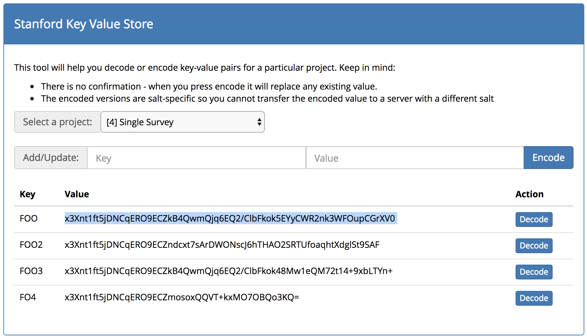

# REDCap Key Value Store

This external modules is intended to store secrets in the External Modules database table and is used by other external modules.

In order to load a KVS object, insert this line into your code after installing this module and enabling it.
You do not need to enable it for a specific project, only from the control center.
```php
// This is how you access an EM class from other code in REDCap
$KVS = \ExternalModules\ExternalModules::getModuleInstance('key_value_store');
```
 * All stored values will be reversibly encrypted
 * This class will only be available if you have already bootstrapped REDCap (meaning if a plugin or DET, you must first include `redcap_connect.php`)

## Setting a Value
```php
// Parameters are: $project_id, $key, $value
$KVS->setValue($project_id, "FOO", "BAR");
```
In the external_modules_settings table, you will now have a value for FOO with an encrypted version of BAR.  Then encryption uses the database.php $salt variable so it will not necessarily work on another server if copied in the encrypted format.

| Project | Key | Value |
| --- | --- | --------------------------------------------------------------- |
| 123 | FOO | KVS Encrypted: `x3Xnt1ft5jDNCqERO9ECZkB4QwmQjq6EQ2/ClbFkok5EYyCWR2nk3WFOupCGrXV0` |


## Getting a Value
To retrieve a value:
```php
// Later in your code, you can retrieve BAR as:
$value = $KVS->getValue($project_id, "FOO");
```
`$value` = 'BAR'
 * If the $project_id is not provided, it will return FALSE.
 
## Viewing Project Values
There is a utility accessible from the control center that shows you all external module settings for a given project, and also allows you to set values.
 * Be careful that you can also see non-encrypted settings
 * Be careful not to overwrite any other settings - no history/cache is kept
 
 
